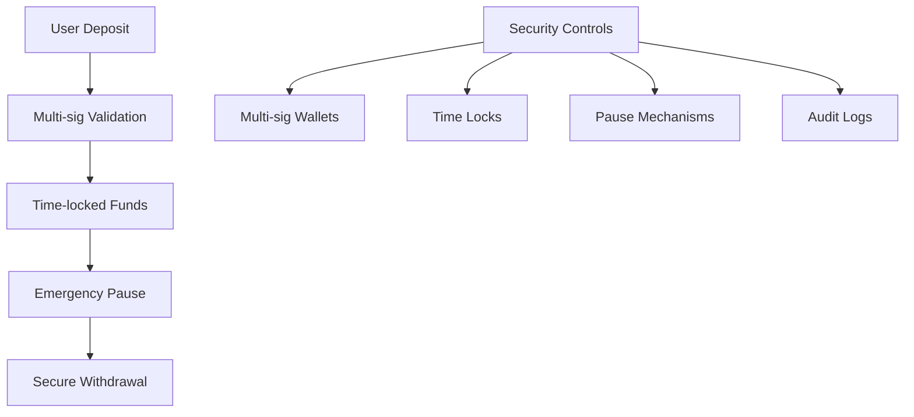

# Architecture Documentation

This document provides a comprehensive overview of the Starknet Lightning Mixer architecture, including system design, component interactions, and technical decisions.

## 🏗️ System Overview

The Starknet Lightning Mixer is a privacy-enhancing service that combines multiple technologies to provide maximum transaction privacy while maintaining speed and efficiency.

### High-Level Architecture

```
┌─────────────────┐    ┌─────────────────┐    ┌─────────────────┐
│   Frontend      │    │   Backend       │    │   Blockchain    │
│                 │    │                 │    │                 │
│   Next.js App   │◄──►│   Express API   │◄──►│  Starknet SCs   │
│   React UI      │    │   Business      │    │  Lightning      │
│   State Mgmt    │    │   Logic         │    │  Cashu          │
└─────────────────┘    └─────────────────┘    └─────────────────┘
```

## 🧩 Core Components

### 1. Frontend Layer (Next.js 15)

**Technology Stack:**
- Next.js 15 with App Router
- React 18 with TypeScript
- Tailwind CSS for styling
- Radix UI for components
- Zustand for state management
- Starknet-react for blockchain interaction

**Key Features:**
- Server-side rendering (SSR)
- Responsive design
- Real-time updates via WebSocket
- Progressive Web App (PWA) capabilities

**Directory Structure:**
```
src/
├── app/                    # Next.js app router
│   ├── globals.css        # Global styles
│   ├── layout.tsx         # Root layout
│   ├── page.tsx           # Home page
│   ├── mix/               # Mixing interface
│   ├── history/           # Transaction history
│   ├── wallet/            # Wallet settings
│   └── [...other pages]   # Additional pages
├── components/            # React components
│   ├── common/            # Shared components
│   ├── layout/            # Layout components
│   ├── mixer/             # Mixer-specific components
│   └── ui/                # UI component library
├── hooks/                 # Custom React hooks
├── lib/                   # Utilities and configs
├── store/                 # Zustand state management
└── types/                 # TypeScript definitions
```

### 2. Backend Layer (Express.js)

**Technology Stack:**
- Node.js with Express.js
- TypeScript for type safety
- WebSocket for real-time communication
- SQLite for data persistence
- JWT for authentication

**Key Features:**
- RESTful API design
- WebSocket support for real-time updates
- Modular service architecture
- Comprehensive error handling
- Request logging and monitoring

**Directory Structure:**
```
server/
├── src/
│   ├── routes/            # API routes
│   │   ├── mixing.ts      # Mixing endpoints
│   │   ├── transactions.ts # Transaction endpoints
│   │   ├── lightning.ts   # Lightning Network endpoints
│   │   ├── cashu.ts       # Cashu endpoints
│   │   └── index.ts       # Route aggregation
│   ├── services/          # Business logic
│   │   ├── MixingService.ts
│   │   ├── LightningService.ts
│   │   ├── CashuService.ts
│   │   └── AtomiqService.ts
│   ├── models/            # Database models
│   │   ├── Database.ts
│   │   ├── Transaction.ts
│   │   └── User.ts
│   ├── utils/             # Utility functions
│   ├── middleware/        # Express middleware
│   ├── config/            # Configuration
│   └── types/             # TypeScript definitions
├── dist/                  # Compiled output
└── package.json
```

### 3. Blockchain Layer

**Starknet Smart Contracts:**
- Deposit contract for token custody
- Withdrawal contract with timelocks
- Multi-signature security controls
- Emergency pause mechanisms

**Lightning Network Integration:**
- Bitcoin Lightning Network for fast transfers
- Off-chain transaction processing
- Atomic swap capabilities

**Cashu E-Cash Integration:**
- Privacy-focused e-cash system
- Cryptographic proofs
- Blind signatures for anonymity

## 🔄 Data Flow

### 1. User initiates mix request

```
Frontend (React) → Backend API → Mixing Service → Starknet Contract
```

### 2. Lightning Network conversion

```
Starknet Contract → Lightning Service → Lightning Network → Bitcoin
```

### 3. Cashu mixing process

```
Bitcoin → Cashu Service → Cashu Tokens → Mixed Tokens
```

### 4. Final withdrawal

```
Mixed Tokens → Starknet Contract → User Wallet
```

## 🔐 Security Architecture

### Smart Contract Security



### Privacy Protection

1. **No Personal Data Collection**
   - No IP address logging
   - No wallet tracking
   - No transaction linking

2. **Cryptographic Privacy**
   - Zero-knowledge proofs
   - Blind signatures
   - Ring signatures

3. **Network-Level Privacy**
   - Tor support (optional)
   - Random delays
   - Transaction splitting

## 🌐 Network Architecture

### External Integrations

```
┌─────────────────┐    ┌─────────────────┐    ┌─────────────────┐
│   Starknet       │    │ Lightning       │    │   Cashu          │
│   Network        │    │ Network         │    │   Mint           │
│                 │    │                 │    │                 │
│ - Smart         │    │ - Fast           │    │ - E-cash        │
│   Contracts     │    │   Transfers     │    │   Tokens        │
│ - Account       │    │ - Low Fees       │    │ - Privacy       │
│   Abstraction   │    │ - Bitcoin       │    │   Features      │
└─────────────────┘    └─────────────────┘    └─────────────────┘
```

### API Gateway

```
Internet → Nginx → Load Balancer → Express API → Services
```

## 📊 State Management

### Frontend State (Zustand)

```typescript
interface MixerStore {
  // Transaction state
  currentTransaction: Transaction | null;
  transactionHistory: Transaction[];

  // UI state
  isLoading: boolean;
  error: string | null;

  // User settings
  privacySettings: PrivacySettings;

  // Actions
  createMix: (params: MixParams) => Promise<void>;
  checkStatus: (id: string) => Promise<void>;
  updateSettings: (settings: PrivacySettings) => void;
}
```

### Backend State (Database)

```sql
-- Transactions table
CREATE TABLE transactions (
  id TEXT PRIMARY KEY,
  type TEXT NOT NULL,
  amount TEXT NOT NULL,
  token TEXT NOT NULL,
  status TEXT NOT NULL,
  created_at TIMESTAMP DEFAULT CURRENT_TIMESTAMP,
  updated_at TIMESTAMP DEFAULT CURRENT_TIMESTAMP
);

-- Users table
CREATE TABLE users (
  id TEXT PRIMARY KEY,
  wallet_address TEXT UNIQUE NOT NULL,
  created_at TIMESTAMP DEFAULT CURRENT_TIMESTAMP
);
```

## 🔧 Development Architecture

### Build Process

```
Source Code → TypeScript Compiler → Bundler → Optimized Build → Deployment
```

### Testing Architecture

```
Unit Tests → Integration Tests → E2E Tests → Security Audits → Production
```

### Deployment Architecture

```
Git Repository → CI/CD Pipeline → Build → Test → Deploy to Vercel
```

## 🚀 Performance Optimization

### Frontend Optimization

1. **Code Splitting**
   - Route-based splitting
   - Component-based splitting
   - Dynamic imports

2. **Asset Optimization**
   - Image optimization
   - Font optimization
   - CSS minification

3. **Caching Strategy**
   - Browser caching
   - CDN caching
   - Service worker caching

### Backend Optimization

1. **Database Optimization**
   - Connection pooling
   - Query optimization
   - Indexing strategy

2. **API Optimization**
   - Response caching
   - Rate limiting
   - Compression

3. **Monitoring**
   - Performance metrics
   - Error tracking
   - Health checks

## 🔄 Scalability Architecture

### Horizontal Scaling

```
Load Balancer → Multiple API Instances → Shared Database
```

### Database Scaling

```
Primary DB → Read Replicas → Cache Layer → Backup Storage
```

### Microservices Architecture (Future)

```
API Gateway → Mixing Service → Lightning Service → Cashu Service → Storage Service
```

## 📋 Technology Choices

### Frontend Technology Decisions

| Technology | Reason |
|-------------|---------|
| Next.js 15 | Latest features, excellent performance |
| React 18 | Component-based architecture |
| TypeScript | Type safety and better development experience |
| Tailwind CSS | Utility-first CSS framework |
| Zustand | Simple state management |

### Backend Technology Decisions

| Technology | Reason |
|-------------|---------|
| Express.js | Mature, flexible Node.js framework |
| TypeScript | Type safety for backend code |
| SQLite | Simple, reliable database for development |
| WebSocket | Real-time communication |

### Blockchain Technology Decisions

| Technology | Reason |
|-------------|---------|
| Starknet | Scalable, low-fee blockchain |
| Lightning Network | Fast, private off-chain transactions |
| Cashu | Privacy-focused e-cash system |

## 🔮 Future Architecture Plans

### Phase 1: Enhanced Privacy
- Implement zero-knowledge proofs
- Add Tor integration
- Implement ring signatures

### Phase 2: Multi-Chain Support
- Add support for other L2s
- Cross-chain mixing capabilities
- Bridging solutions

### Phase 3: Advanced Features
- AI-powered privacy optimization
- Advanced analytics
- Mobile app development

## 📚 Additional Resources

- [API Documentation](./api.md)
- [Security Guidelines](./security.md)
- [Deployment Guide](./deployment.md)
- [Contributing Guide](../CONTRIBUTING.md)

---

*Last updated: January 2024*